# 📐 MEP Drawing Interpretation System

A production-grade, document-aware Mechanical, Electrical, and Plumbing (MEP) Blueprint Interpretation System. It ingests complex multi-page engineering drawing PDFs, extracts visual layout regions and OCR text tokens, indexes an active [EvidenceStore](file:///f:/D%20folder/construction/core/evidence_store.py), and resolves technical questions with visual bounding-box highlights using a tiered VLM execution chain.

---

## 🗺️ System Architecture Flow

The system is structured into logical tiers coordinating ingestion, indexing, retrieval, and verification:

```mermaid
flowchart TD
    subgraph UI ["User Interface Layer"]
        A[app.py]
        A_Debug[core/debug_panel.py]
    end

    subgraph Orchestrator ["Pipeline & Routing Layer"]
        B[core/orchestrator.py]
        B1[core/question_analyzer.py]
        B2[core/page_ranker.py]
        B3[core/context_builder.py]
        B4[core/session_memory.py]
    end

    subgraph Ingestion ["Ingestion & Document Layout Parser"]
        C[core/pdf_processor.py]
        C1[core/layout_extractor.py]
        C2[core/ocr_engine.py]
        C3[core/document_intelligence.py]
    end

    subgraph Store ["Indexed Evidence Storage"]
        D[core/evidence_store.py]
    end

    subgraph Models ["Reasoning & LLM Tier"]
        E1[models/nvidia_client.py]
        E2[models/gemini_client.py]
        E3[models/qwen_client.py]
    end

    subgraph Verification ["Validation, Audits & Verification"]
        F1[core/model_verifier.py]
        F2[core/counting_engine.py]
        F3[core/confidence_engine.py]
        F4[core/validator.py]
    end

    subgraph Grounding ["Highlights & Layout Bounds Drawing"]
        G1[core/grounding_engine.py]
        G2[core/annotation_engine.py]
    end

    A -->|1. Upload & Ingest| C
    C -->|2. Heuristic Zones| C1
    C -->|3. OCR Text Extr.| C2
    C -->|4. Doc Intelligence| C3
    C -->|5. Build Repo| D
    
    A -->|6. Question Query| B
    B -->|7. Classify Intent| B1
    B -->|8. Rank Pages| B2
    B -->|9. Lookup memory| B4
    B -->|10. Build context packet| B3
    B3 -->|11. Search Store| D
    
    B -->|12. Tiered Reasoning| E1 & E2 & E3
    B -.->|13. Overlap Verification| F1
    B -->|14. Audit Quantity| F2
    B -->|15. Compute Confidence| F3
    B -->|16. Safety Constraint| F4
    
    B -->|17. Draw Grounding| G1
    A -->|18. Draw Regions| G2
```



---

## 📦 Component Tier Breakdown

### 1. Ingestion & Document Parser
* **[pdf_processor.py](file:///f:/D%20folder/construction/core/pdf_processor.py)**: Ingests raw PDFs, generates cryptographic SHA-256 hashes to manage caching, renders sheets as high-resolution images, runs layout segmenters and OCR text analyzers, executes Document Intelligence classification, and serializes the resulting repository to disk.
* **[layout_extractor.py](file:///f:/D%20folder/construction/core/layout_extractor.py)**: Performs heuristic geometric boundary analysis to segment drawing sheets into logical layout blocks: Legend, General Notes, Title Block, and Placed Drawing Area.
* **[ocr_engine.py](file:///f:/D%20folder/construction/core/ocr_engine.py)**: Orchestrates text extraction with fallbacks: native vector text extraction (via `PyMuPDF`) → `PaddleOCR` → `EasyOCR`. Maps coordinate bounds of text tokens to layout regions based on overlap ratios.
* **[document_intelligence.py](file:///f:/D%20folder/construction/core/document_intelligence.py)**: Processes all pages upon ingestion using multi-dimensional scoring rules to assign mutually exclusive page classifications (legend, cover, notes, schedule, drawing, title_block). Extracts unique tags, symbols, specifications, and abbreviation mappings across the entire drawing corpus.

### 2. Request Routing & Context Assembly
* **[orchestrator.py](file:///f:/D%20folder/construction/core/orchestrator.py)**: The main controller. Directs question intent classification, schedules page ranking filters, calls the context builder, triggers model queries, routes verifier chains, audits quantities, caps scores, and draws visual grounding highlights.
* **[question_analyzer.py](file:///f:/D%20folder/construction/core/question_analyzer.py)**: Maps user questions to 13 discrete engineering intents to apply custom prompt formats and page selection offsets.
* **[page_ranker.py](file:///f:/D%20folder/construction/core/page_ranker.py)**: Ranks sheets for relevance by checking query keywords, tag patterns, and symbols against page indexes. Applies intent adjustments (e.g. boosting drawing sheets and penalizing cover sheets for counting queries).
* **[context_builder.py](file:///f:/D%20folder/construction/core/context_builder.py)**: Formats text tokens in reading order (sorted by `ymin` then `xmin`) using coordinate representation `[xmin, ymin, xmax, ymax] text`. Always prepends definition sheet details (notes/legend sheets) before normal drawing page details to ensure abbreviation and symbol translations are available to the VLM.
* **[session_memory.py](file:///f:/D%20folder/construction/core/session_memory.py)**: Session context manager that stores verified definitions, abbreviations, and parameters throughout a user query session, pre-injecting them into subsequent questions.

### 3. Reasoning & Verification
* **[nvidia_client.py](file:///f:/D%20folder/construction/models/nvidia_client.py)**: (Tier 1 Client) Encodes images to base64 and queries hosted visual reasoning services with exponential retry logic.
* **[gemini_client.py](file:///f:/D%20folder/construction/models/gemini_client.py)**: (Tier 2 Client) Connects to `gemini-2.5-flash` using native multi-image prompt execution to inspect multiple sheets simultaneously.
* **[qwen_client.py](file:///f:/D%20folder/construction/models/qwen_client.py)**: (Tier 3 Client) Interfaces with a local OpenAI-compatible endpoint (Ollama) to query `qwen2.5-vl`.
* **[model_verifier.py](file:///f:/D%20folder/construction/core/model_verifier.py)**: Computes a consensus agreement metric between primary and verification models using token Jaccard similarity and visual bounding box Intersection-over-Union (IoU) overlap metrics.
* **[counting_engine.py](file:///f:/D%20folder/construction/core/counting_engine.py)**: Audits counting answers by extracting the target noun phrase, resolving abbreviation shorthands dynamically from legend regions, and filtering out inline legend blocks to avoid false counts.
* **[confidence_engine.py](file:///f:/D%20folder/construction/core/confidence_engine.py)**: Applies a weighted combination formula to determine final confidence ratings. Enforces strict consistency capping rules unless visual grounding highlights are confirmed.
* **[validator.py](file:///f:/D%20folder/construction/core/validator.py)**: Enforces coordinate limit validations [0.0, 1.0], checks sheet alignment, and flags alphanumeric warnings if answers mention terms not present in page OCR.

---

## ⚡ Core Algorithmic Upgrades

### Mutually Exclusive Page Classifier Scoring Rules
In [document_intelligence.py](file:///f:/D%20folder/construction/core/document_intelligence.py), each sheet is scored across multiple dimensions to resolve a single mutually exclusive type:
* **Cover Sheet**: Points added for cover sheet keywords (`+5`), drawing indices (`+5`), and presence of title blocks.
* **Legend Page**: Points added for legend keywords (`+5`), layout legend blocks (`+2`), and legend word counts (`+5`).
* **Notes Sheet**: Points added for specification section prefixes (`+3`), notes keywords (`+4`), and notes layout block overrides (`+2`).
* **Schedule Page**: Points added for schedule/load keywords (`+5`) and column layout matrices (`+3`).
* **Drawing Sheet**: Highest score triggers if there are drawing layout regions (`+5`), equipment tags (`+3`), and high OCR density elements (`+2` if >400 elements, `+1` if >200 elements).

### Dynamic Abbreviations & Symbol Lookups
When auditing counting questions (such as *"How many diffusers on layout?"*), [counting_engine.py](file:///f:/D%20folder/construction/core/counting_engine.py) extracts the target noun phrase (`diffuser`), finds matching description texts in legend sheets, checks adjacent words in the same coordinate rows, and resolves shorthand symbols (e.g. `CD-1`) automatically from the drawing's own legend rather than using a static, hardcoded list.

### Confidence Capping Override Rule
The system applies strict confidence caps:
* Review required flag set $\rightarrow$ capped at `0.69` max.
* OCR evidence missing $\rightarrow$ capped at `0.59` max.
* Both conditions trigger $\rightarrow$ capped at `0.49` max.

**Bypass Rule**: If visual bounding boxes are generated and verified (`has_bbox == True` or `visual_evidence_only == True`), confidence capping is bypassed. This ensures that valid visual grounding overrides default caps when OCR keywords are missing (e.g. for purely drawing symbol counts).

### VLM JSON Response Normalization
If the VLM output returns a JSON string, [app.py](file:///f:/D%20folder/construction/app.py) and [debug_panel.py](file:///f:/D%20folder/construction/core/debug_panel.py) intercept it and extract elements in priority order:
1. `answer` key
2. `reasoning_summary` key
3. `reasoning` key
If parsing fails completely, the system strips remaining JSON symbols (`[ ] { } " :`) using regular expression patterns to ensure a clean, human-readable answer is displayed.

---

## 🛠️ Environment Configuration

Define local secrets, API endpoints, and system parameters inside a local `.env` file:

```env
# API credentials
GEMINI_API_KEY=your_gemini_api_key_here
NVIDIA_API_KEY=your_nvidia_api_key_here

# Hosted VLM Tier 1 Parameters
NVIDIA_ENDPOINT=https://integrate.api.nvidia.com/v1/chat/completions
NVIDIA_PRIMARY_MODEL=moonshotai/kimi-k2.6
NVIDIA_PAYLOAD_FORMAT=array

# Local Fallback Model (Ollama)
QWEN_API_BASE=http://localhost:11434/v1
QWEN_MODEL=qwen2.5-vl

# Render configurations
RENDER_DPI=200
CONFIDENCE_THRESHOLD=0.70
```

---

## 🚀 Execution & Command Reference

### Launch the Streamlit Dashboard UI
```bash
streamlit run app.py
```

### Run Diagnostic Environment Checks
Checks GPU availability, OCR module parameters, package imports, and Ollama configuration:
```bash
python check.py
```

### Run System Unit Tests
Runs the test suite verifying layout extractors, intent analyzers, counting consensus algorithms, verifiers, and normalizations (44 tests total):
```bash
python -m unittest discover -s tests
```

---

## 🛡️ Common Question Categories to Query
* **Visual Counts**: *"How many supply diffusers are located in the drawing area?"*
* **Symbol Lookup**: *"What does CD-1 mean on the legend sheet?"*
* **Design Details**: *"What copper pipe specifications apply under general note 3?"*
* **Schedule Reference**: *"What CFM capacity is configured for FCU-1?"*
* **Revision History**: *"What revisions are registered inside the title block?"*
