# MEP Drawing Interpretation System — Architecture & File Map

This document provides a comprehensive mapping of every file in the codebase. It describes what each file does at a code level and how it is connected to the overall system architecture.

---

## 1. Architectural Component Overview

The MEP Drawing Interpretation System is structured into logical tiers:

```mermaid
flowchart TD
    subgraph UI ["User Interface Layer"]
        A[app.py]
    end

    subgraph Orchestrator ["Pipeline & Routing Layer"]
        B[core/orchestrator.py]
        B1[core/question_analyzer.py]
        B2[core/page_ranker.py]
        B3[core/context_builder.py]
        B4[core/session_memory.py]
    end

    subgraph Ingestion ["Ingestion & Document Layout Parser"]
        C[core/pdf_processor.py]
        C1[core/layout_extractor.py]
        C2[core/ocr_engine.py]
        C3[core/document_intelligence.py]
    end

    subgraph Store ["Indexed Evidence Storage"]
        D[core/evidence_store.py]
    end

    subgraph Models ["Reasoning & LLM Tier"]
        E1[models/nvidia_client.py]
        E2[models/gemini_client.py]
        E3[models/qwen_client.py]
    end

    subgraph Verification ["Validation, Audits & Verification"]
        F1[core/model_verifier.py]
        F2[core/counting_engine.py]
        F3[core/confidence_engine.py]
        F4[core/validator.py]
    end

    subgraph Grounding ["Highlights & Layout Bounds Drawing"]
        G1[core/grounding_engine.py]
        G2[core/annotation_engine.py]
    end

    A -->|1. Upload & Ingest| C
    C -->|2. Heuristic Zones| C1
    C -->|3. OCR Text Extr.| C2
    C -->|4. Doc Intelligence| C3
    C -->|5. Build Repo| D
    
    A -->|6. Question Query| B
    B -->|7. Classify Intent| B1
    B -->|8. Rank Pages| B2
    B -->|9. Lookup memory| B4
    B -->|10. Build context packet| B3
    B3 -->|11. Search Store| D
    
    B -->|12. Tiered Reasoning| E1 & E2 & E3
    B -.->|13. Overlap Verification| F1
    B -->|14. Audit Quantity| F2
    B -->|15. Compute Confidence| F3
    B -->|16. Safety Constraint| F4
    
    B -->|17. Draw Grounding| G1
    A -->|18. Draw Regions| G2
```

---

## 2. Directory & File Breakdown

### Root Directory Configuration & UI

* #### [config.py](file:///f:/D%20folder/construction/config.py)
  * **Role**: System Configuration Loader
  * **Logic**: Configures base paths (uploads, rendered pages, annotations, repositories) using Python's `pathlib.Path`. Loads key-value environment variables from `.env` via `python-dotenv`. Defines constants like `GEMINI_API_KEY`, `NVIDIA_API_KEY`, `NVIDIA_ENDPOINT`, `NVIDIA_PRIMARY_MODEL`, `NVIDIA_PAYLOAD_FORMAT` (defaulting to "array"), `QWEN_API_BASE`, `QWEN_MODEL` (defaulting to "qwen2.5-vl"), `RENDER_DPI` (defaulting to 200), and `CONFIDENCE_THRESHOLD` (defaulting to 0.70).
  * **Connections**: Imported by [app.py](file:///f:/D%20folder/construction/app.py), [pdf_processor.py](file:///f:/D%20folder/construction/core/pdf_processor.py), [evidence_store.py](file:///f:/D%20folder/construction/core/evidence_store.py), [orchestrator.py](file:///f:/D%20folder/construction/core/orchestrator.py), [nvidia_client.py](file:///f:/D%20folder/construction/models/nvidia_client.py), [gemini_client.py](file:///f:/D%20folder/construction/models/gemini_client.py), and [qwen_client.py](file:///f:/D%20folder/construction/models/qwen_client.py).

* #### [app.py](file:///f:/D%20folder/construction/app.py)
  * **Role**: Streamlit Web UI Dashboard
  * **Logic**: Sets up the Streamlit page layout and custom CSS styling. Ingests PDF files using [PDFProcessor](file:///f:/D%20folder/construction/core/pdf_processor.py), parses them, and saves them in [EvidenceStore](file:///f:/D%20folder/construction/core/evidence_store.py). Renders multi-image and multi-sheet drawing views, handles dropdown and sidebar controls for sheet navigation, Reasoning Modes, settings, layout region toggles, and query execution. Displays grounded box highlights on correct sheets, shows validation warning notes/alerts when visual grounding overrides confidence caps, and details execution traces in the [DebugPanel](file:///f:/D%20folder/construction/core/debug_panel.py). Neutralizes the PyTorch class loading warning at startup.
  * **Connections**: Main entry point file. Imports [config.py](file:///f:/D%20folder/construction/config.py), [pdf_processor.py](file:///f:/D%20folder/construction/core/pdf_processor.py), [evidence_store.py](file:///f:/D%20folder/construction/core/evidence_store.py), [orchestrator.py](file:///f:/D%20folder/construction/core/orchestrator.py), [annotation_engine.py](file:///f:/D%20folder/construction/core/annotation_engine.py), and [debug_panel.py](file:///f:/D%20folder/construction/core/debug_panel.py).

* #### [requirements.txt](file:///f:/D%20folder/construction/requirements.txt)
  * **Role**: Python Packages Dependency Manifest
  * **Logic**: Declares required external libraries: `pymupdf`, `pillow`, `pydantic`, `streamlit`, `google-genai`, `python-dotenv`, `requests`, and `easyocr`.
  * **Connections**: Standard setup file parsed by package installers (`pip install`).

* #### [.env](file:///f:/D%20folder/construction/.env)
  * **Role**: Local Secrets & Parameters Configuration
  * **Logic**: Holds API keys, endpoint configurations, model parameters, render DPI, and validation parameters. Excluded from version control.
  * **Connections**: Loaded dynamically by [config.py](file:///f:/D%20folder/construction/config.py) at runtime.

* #### [.env.example](file:///f:/D%20folder/construction/.env.example)
  * **Role**: Configuration Template File
  * **Logic**: Contains dummy parameters showing the layout and keys required for a functional local configuration.
  * **Connections**: Serves as a guide for developers to initialize their local [.env](file:///f:/D%20folder/construction/.env) files.

* #### [decision_log.md](file:///f:/D%20folder/construction/decision_log.md)
  * **Role**: Project Design Log Documentation
  * **Logic**: Detailed summaries of architectural updates, multi-model verification rationale, counting penalties, weightings for confidence scores, and custom debug panel capabilities.
  * **Connections**: Technical reference file.

* #### [README.md](file:///f:/D%20folder/construction/README.md)
  * **Role**: Developer Guide & System Overview
  * **Logic**: Includes installation steps, runtime instructions, Mermaid architecture diagrams, fallback details, and sample prompt queries.
  * **Connections**: Acts as the primary developer documentation entry point.

* #### [checkingmodels.py](file:///f:/D%20folder/construction/checkingmodels.py)
  * **Role**: Legacy Gemini API verification script
  * **Logic**: A simple script configuring a hardcoded Gemini key and calling `list_models()` via the legacy `google-generativeai` SDK to print compatible model endpoints.
  * **Connections**: Used manually for API keys and account access checks.

* #### [check.py](file:///f:/D%20folder/construction/check.py)
  * **Role**: Environment Health Check Utility
  * **Logic**: Checks Python package versions, tests GPU CUDA availability, checks PaddleOCR initialization parameters, and queries the local Ollama tags endpoint to list loaded models.
  * **Connections**: Run manually by developers to verify environment configurations before executing main applications.

---

### Core Pipeline Modules (`core/` directory)

* #### [core/__init__.py](file:///f:/D%20folder/construction/core/__init__.py)
  * **Role**: Core Package Initializer
  * **Logic**: Declares the folder as an importable Python package.
  * **Connections**: Enables path imports.

* #### [core/annotation_engine.py](file:///f:/D%20folder/construction/core/annotation_engine.py)
  * **Role**: Visual Layout Region Annotator
  * **Logic**: Reads coordinates from [LayoutRegion](file:///f:/D%20folder/construction/schemas/document_schema.py#L21-L29), scales them to pixel bounds, and overlays color boundary boxes on drawings: Legend (Green), notes (Blue), title block (Purple), and drawing area (Orange). Also writes text boxes containing labels on the top-left margin of regions.
  * **Connections**: Imported and called by [app.py](file:///f:/D%20folder/construction/app.py) when layout visualizer modes are enabled.

* #### [core/confidence_engine.py](file:///f:/D%20folder/construction/core/confidence_engine.py)
  * **Role**: Confidence Score Calculator
  * **Logic**: Computes evidence-based scores using intent-specific formulas. Enforces consistency capping rules (e.g., capping at 0.69, 0.59, or 0.49) based on OCR matches and review status, but bypasses these caps completely if visual grounding is present (i.e. `has_bbox == True`). Logs detailed audit checks to the console and orchestrator.
  * **Connections**: Called by [RequestOrchestrator](file:///f:/D%20folder/construction/core/orchestrator.py) to assess interpretation answers.

* #### [core/context_retriever.py](file:///f:/D%20folder/construction/core/context_retriever.py)
  * **Role**: Targeted Prompt Context Compiler (Legacy)
  * **Logic**: Replaced by ContextBuilder in the document-aware pipeline. Filters drawing OCR word elements down to notes or legends based on layout bounds.
  * **Connections**: Legacy context manager.

* #### [core/counting_handler.py](file:///f:/D%20folder/construction/core/counting_handler.py)
  * **Role**: Legacy Counting Verification Auditor
  * **Logic**: Replaced by CountingEngine in the document-aware pipeline. Performs basic OCR matching audits.
  * **Connections**: Legacy verification manager.

* #### [core/debug_panel.py](file:///f:/D%20folder/construction/core/debug_panel.py)
  * **Role**: Diagnostic Panel UI Renderer
  * **Logic**: Renders the 5-Tab Debug Control Board (Answer, Evidence, Models, Validation, Confidence). Parses JSON-formatted model responses using raw key selection and regex fallbacks, displays page classifications, details page ranking keyword/tag/symbol matches, counting consensus audits, and confidence consistency warning details.
  * **Connections**: Imported and called by [app.py](file:///f:/D%20folder/construction/app.py).

* #### [core/evidence_store.py](file:///f:/D%20folder/construction/core/evidence_store.py)
  * **Role**: Page & OCR Text Query Store
  * **Logic**: Wraps the [DocumentRepository](file:///f:/D%20folder/construction/schemas/document_schema.py#L41-L50) cache. Exposes query functions: single-word searches, multi-word reading-order phrase matching, layout region overlaps, fuzzy string matching via `difflib.SequenceMatcher`, and spatial nearest-neighbor coordinate distance searches.
  * **Connections**: Queried by [app.py](file:///f:/D%20folder/construction/app.py), [ContextRetriever](file:///f:/D%20folder/construction/core/context_retriever.py), [CountingHandler](file:///f:/D%20folder/construction/core/counting_handler.py), [Validator](file:///f:/D%20folder/construction/core/validator.py), and [RequestOrchestrator](file:///f:/D%20folder/construction/core/orchestrator.py).

* #### [core/grounding_engine.py](file:///f:/D%20folder/construction/core/grounding_engine.py)
  * **Role**: Bounding Box Grounding Highlighter
  * **Logic**: Reads normalized coordinates, scales them to the drawing image pixels, and overlays transparent yellow fills with solid red borders (width 4) highlighting the answer evidence.
  * **Connections**: Called by [RequestOrchestrator](file:///f:/D%20folder/construction/core/orchestrator.py) to generate annotated images.

* #### [core/layout_extractor.py](file:///f:/D%20folder/construction/core/layout_extractor.py)
  * **Role**: Visual Drawing Layout Segmenter
  * **Logic**: Segments pages into Legend, General Notes, Title Block, and Drawing Area. Uses PyMuPDF's `search_for` to locate keyword anchors (e.g. TITLE, GENERAL NOTES, LEGEND) on pages, using relative offsets and margins as fallback boundaries.
  * **Connections**: Called by [PDFProcessor](file:///f:/D%20folder/construction/core/pdf_processor.py) to parse layout structures.

* #### [core/model_verifier.py](file:///f:/D%20folder/construction/core/model_verifier.py)
  * **Role**: Multi-Model Consensus Verifier
  * **Logic**: Compares textual answers using token-based Jaccard similarity and visual bounding boxes using Intersection-over-Union (IoU) overlap algorithms, outputting a weighted agreement metric.
  * **Connections**: Called by [RequestOrchestrator](file:///f:/D%20folder/construction/core/orchestrator.py) during multi-model verification runs.

* #### [core/ocr_engine.py](file:///f:/D%20folder/construction/core/ocr_engine.py)
  * **Role**: OCR Text Extraction Engine
  * **Logic**: Extracts text strings and coordinates from pages. Falls back through PyMuPDF vector extraction (100% accurate for digital drawings), PaddleOCR, and EasyOCR, matching words to layout regions based on spatial overlap ratios.
  * **Connections**: Called by [PDFProcessor](file:///f:/D%20folder/construction/core/pdf_processor.py) to transcribe pages.

* #### [core/orchestrator.py](file:///f:/D%20folder/construction/core/orchestrator.py)
  * **Role**: Request Pipeline Orchestrator
  * **Logic**: Main pipeline coordinator for question queries. Directs intent classification, page ranking (retains layout context but filters drawing pages), context building, memory caching, model execution, agreement checks, counting audits, consistency capping, and grounding. Handles native multi-image prompts, coordinates fallback routing for single-image clients, tracks primary image pages, and ensures grounded boxes map to the correct drawing sheet.
  * **Connections**: Imported and called by [app.py](file:///f:/D%20folder/construction/app.py). Interlinks all other core modules and model clients.

* #### [core/pdf_processor.py](file:///f:/D%20folder/construction/core/pdf_processor.py)
  * **Role**: PDF Ingestion & Serialization pipeline
  * **Logic**: Processes PDF files. Calculates SHA-256 hashes for caching, renders pages as high-resolution images via PyMuPDF (fitz), calls layout extractors and OCR engines, runs document intelligence, and serializes the resulting DocumentRepository to local JSON storage. Auto-upgrades older cached v1.0/v2.0 schemas to populate page classifications on load.
  * **Connections**: Imported and called by [app.py](file:///f:/D%20folder/construction/app.py) when drawings are uploaded.

* #### [core/question_analyzer.py](file:///f:/D%20folder/construction/core/question_analyzer.py)
  * **Role**: Regex Question Intent Classifier
  * **Logic**: Uses regular expressions to classify user questions into 13 categories (counting, legend, abbreviation, notes, specification, title_block, schedule, equipment, cross_sheet, revision, location, conflict, general) and maps them to custom context retrieval templates.
  * **Connections**: Called by [RequestOrchestrator](file:///f:/D%20folder/construction/core/orchestrator.py) before context retrieval.

* #### [core/validator.py](file:///f:/D%20folder/construction/core/validator.py)
  * **Role**: Response Safety Guard
  * **Logic**: Asserts coordinate boundary safety ([0.0, 1.0]), verifies page alignment, and cross-checks key uppercase alphanumeric abbreviations in answers against OCR text, issuing verification warnings if absent.
  * **Connections**: Called by [RequestOrchestrator](file:///f:/D%20folder/construction/core/orchestrator.py) during answer generation.

* #### [core/document_intelligence.py](file:///f:/D%20folder/construction/core/document_intelligence.py)
  * **Role**: Document Intelligence Engine
  * **Logic**: Extracts document-wide properties once upon ingestion. Computes a multi-dimensional scoring profile for every page using target keywords, word counts, and visual layout areas, assigning a single mutually exclusive page type (cover, legend, notes, schedule, drawing, title_block, mixed). Also indexes legend/notes pages and extracts equipment tags, abbreviations, and symbols.
  * **Connections**: Called by [PDFProcessor](file:///f:/D%20folder/construction/core/pdf_processor.py) when parsing a PDF. Output cached inside the DocumentRepository.

* #### [core/page_ranker.py](file:///f:/D%20folder/construction/core/page_ranker.py)
  * **Role**: Page Ranking Engine
  * **Logic**: Computes relevance scores [0.0, 1.0] for all pages based on text keywords, equipment tags, symbol alignments, and intent sheet classes. Applies scoring offsets for counting queries (+0.40 for drawing pages, -0.25 for legend pages, -0.50 for cover pages) and exposes detailed keyword/tag/symbol matches diagnostics.
  * **Connections**: Called by [RequestOrchestrator](file:///f:/D%20folder/construction/core/orchestrator.py) to target searches to specific relevant sheets.

* #### [core/context_builder.py](file:///f:/D%20folder/construction/core/context_builder.py)
  * **Role**: Structured Context Assembly Manager
  * **Logic**: Assembles structured prompts based on intent. Formats OCR elements in reading order (sorted by ymin, then xmin) using standard [xmin, ymin, xmax, ymax] text representation. Prepends descriptive sheet headers and always injects definition pages context (legend and notes sheets containing definitions and symbols) before drawing context for every query intent.
  * **Connections**: Called by [RequestOrchestrator](file:///f:/D%20folder/construction/core/orchestrator.py) to package relevant context.

* #### [core/session_memory.py](file:///f:/D%20folder/construction/core/session_memory.py)
  * **Role**: Session Memory manager
  * **Logic**: Caches resolved symbols, abbreviations, and equipment specs across user queries and prepends them as project context for matching terms. Automatically resets on new uploads.
  * **Connections**: Instantiated and updated in [app.py](file:///f:/D%20folder/construction/app.py), read inside [orchestrator.py](file:///f:/D%20folder/construction/core/orchestrator.py).

* #### [core/counting_engine.py](file:///f:/D%20folder/construction/core/counting_engine.py)
  * **Role**: Counting consensus Engine
  * **Logic**: Performs audits comparing stated counts against visual bounding boxes, OCR matching words, and verifier model consensus. Strips question keywords and singularizes target nouns to extract counting targets. Dynamically resolves standard/legend engineering abbreviations and symbol shorthands using OCR text from legend regions on legend pages rather than hardcoded lists, filters out inline legends and legend pages from counting pools, and tracks matches uniquely.
  * **Connections**: Called by [RequestOrchestrator](file:///f:/D%20folder/construction/core/orchestrator.py) to verify counting questions.

---

### Model API Clients (`models/` directory)

* #### [models/__init__.py](file:///f:/D%20folder/construction/models/__init__.py)
  * **Role**: Models Package Initializer
  * **Logic**: Empty initialization file marking the models/ directory as an importable Python package.
  * **Connections**: Enables path imports.

* #### [models/nvidia_client.py](file:///f:/D%20folder/construction/models/nvidia_client.py)
  * **Role**: Primary reasoning client (Tier 1)
  * **Logic**: Queries NVIDIA's multimodal API. Processes base64 image strings, handles HTTP 429 rate limit retries, parses 202 Accepted status by polling status endpoints with exponential delays, and normalizes plain text, percentages (e.g. '85%'), nulls, and alternate reasoning keys to valid InterpretationResponse schemas.
  * **Connections**: Imported and called by [RequestOrchestrator](file:///f:/D%20folder/construction/core/orchestrator.py) as the primary reasoning client.

* #### [models/gemini_client.py](file:///f:/D%20folder/construction/models/gemini_client.py)
  * **Role**: Secondary fallback client (Tier 2)
  * **Logic**: Queries Google's `gemini-2.5-flash` model via the Google GenAI SDK. Supports native multi-image prompt payloads (sending multiple PIL images in a single call) and applies response normalization to handle confidence strings and reasoning key mapping safely.
  * **Connections**: Imported and called by [RequestOrchestrator](file:///f:/D%20folder/construction/core/orchestrator.py) as the secondary fallback and verifier.

* #### [models/qwen_client.py](file:///f:/D%20folder/construction/models/qwen_client.py)
  * **Role**: Local offline fallback client (Tier 3)
  * **Logic**: Connects to local Ollama endpoints to query `qwen2.5-vl`. Implements an automatic local model fallback list, testing `qwen2.5-vl` -> `smolvlm` -> `smolvlm2` sequentially in case of failures. Applies response normalization to handle confidence strings and reasoning key mapping safely.
  * **Connections**: Imported and called by [RequestOrchestrator](file:///f:/D%20folder/construction/core/orchestrator.py) as the offline fallback and verifier.

---

### Data Schema Layers (`schemas/` directory)

* #### [schemas/__init__.py](file:///f:/D%20folder/construction/schemas/__init__.py)
  * **Role**: Schemas Package Initializer
  * **Logic**: Empty initialization file declaring the folder as a package.
  * **Connections**: Enables path imports.

* #### [schemas/document_schema.py](file:///f:/D%20folder/construction/schemas/document_schema.py)
  * **Role**: Drawing Data Extraction Schema definitions
  * **Logic**: Declares Pydantic schemas: [PageDimension](file:///f:/D%20folder/construction/schemas/document_schema.py#L5-L7), [OCRElement](file:///f:/D%20folder/construction/schemas/document_schema.py#L9-L20), [LayoutRegion](file:///f:/D%20folder/construction/schemas/document_schema.py#L21-L29), [PageEntry](file:///f:/D%20folder/construction/schemas/document_schema.py#L30-L40), and the overall [DocumentRepository](file:///f:/D%20folder/construction/schemas/document_schema.py#L41-L50) serialization structure. Updated to v2.0 to support `doc_intelligence` document summary serialization.
  * **Connections**: Imported by [pdf_processor.py](file:///f:/D%20folder/construction/core/pdf_processor.py), [ocr_engine.py](file:///f:/D%20folder/construction/core/ocr_engine.py), [layout_extractor.py](file:///f:/D%20folder/construction/core/layout_extractor.py), [evidence_store.py](file:///f:/D%20folder/construction/core/evidence_store.py), [orchestrator.py](file:///f:/D%20folder/construction/core/orchestrator.py), and [app.py](file:///f:/D%20folder/construction/app.py).

* #### [schemas/response_schema.py](file:///f:/D%20folder/construction/schemas/response_schema.py)
  * **Role**: Query Interpretation Output Schema definitions
  * **Logic**: Defines Pydantic schema [InterpretationResponse](file:///f:/D%20folder/construction/schemas/response_schema.py#L4-L27) (answer, confidence, page_number, bbox coordinate lists, evidence_found flag, review_required flag, and reasoning_summary).
  * **Connections**: Imported by all model clients, [RequestOrchestrator](file:///f:/D%20folder/construction/core/orchestrator.py), [Validator](file:///f:/D%20folder/construction/core/validator.py), and [ModelVerifier](file:///f:/D%20folder/construction/core/model_verifier.py).

---

### Query Prompts Layers (`prompts/` directory)

* #### [prompts/__init__.py](file:///f:/D%20folder/construction/prompts/__init__.py)
  * **Role**: Prompts Package Initializer
  * **Logic**: Empty initialization file declaring the folder as a package.
  * **Connections**: Enables path imports.

* #### [prompts/reasoning_templates.py](file:///f:/D%20folder/construction/prompts/reasoning_templates.py)
  * **Role**: Prompt Intent templates
  * **Logic**: Declares prompt instructions for specialized drawing question intents: Legend (`LEGEND_TEMPLATE`), general notes (`NOTES_TEMPLATE`), equipment specs (`EQUIPMENT_TEMPLATE`), location coordinates (`LOCATION_TEMPLATE`), physical conflicts (`CONFLICT_TEMPLATE`), object counting (`COUNTING_TEMPLATE`), and general QA (`GENERAL_TEMPLATE`).
  * **Connections**: Imported by [RequestOrchestrator](file:///f:/D%20folder/construction/core/orchestrator.py) to build queries.

* #### [prompts/system_prompts.py](file:///f:/D%20folder/construction/prompts/system_prompts.py)
  * **Role**: General System Prompts
  * **Logic**: Holds base rules (`SYSTEM_INSTRUCTION`) instructing LLMs on strict visible evidence checks and fallback triggers.
  * **Connections**: Imported by [gemini_client.py](file:///f:/D%20folder/construction/models/gemini_client.py) and [qwen_client.py](file:///f:/D%20folder/construction/models/qwen_client.py).

---

### System Unit Test Suite (`tests/` directory)

* #### [tests/__init__.py](file:///f:/D%20folder/construction/tests/__init__.py)
  * **Role**: Tests Package Initializer
  * **Logic**: Empty initialization file declaring the folder as a package.
  * **Connections**: Enables package-level testing discovery.

* #### [tests/test_interpreter.py](file:///f:/D%20folder/construction/tests/test_interpreter.py)
  * **Role**: System Unit Tests
  * **Logic**: Hosts 44 unit tests verifying correctness across all subsystems (layout extraction, bounds validators, OCR term cross-verification, confidence weight formulas, evidence store queries, intent classifiers, verifiers, counting consensus audits, NVIDIA completions, response normalizers, page classification scoring, and capping consistency).
  * **Connections**: Executed standalone by developer test runs (`python -m unittest discover -s tests`).
